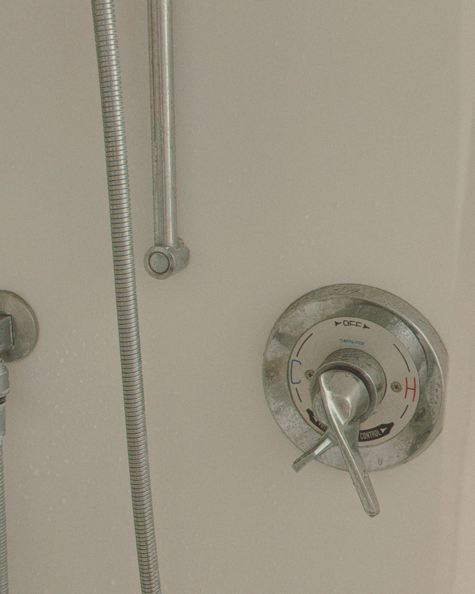
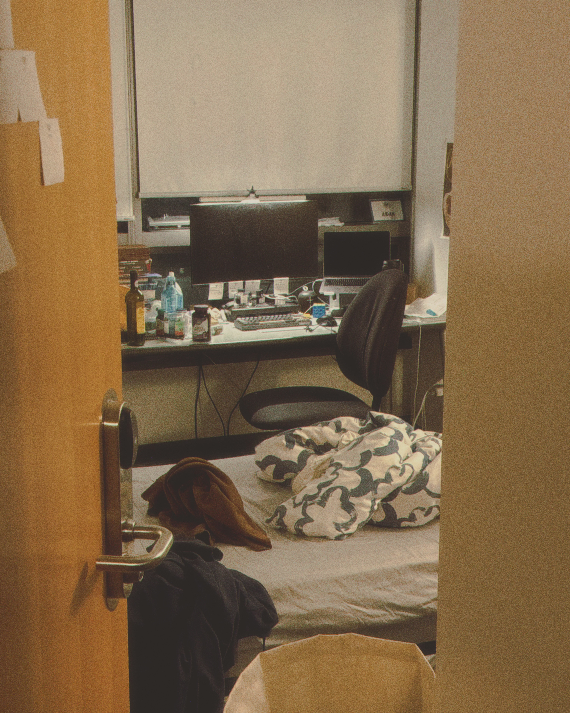
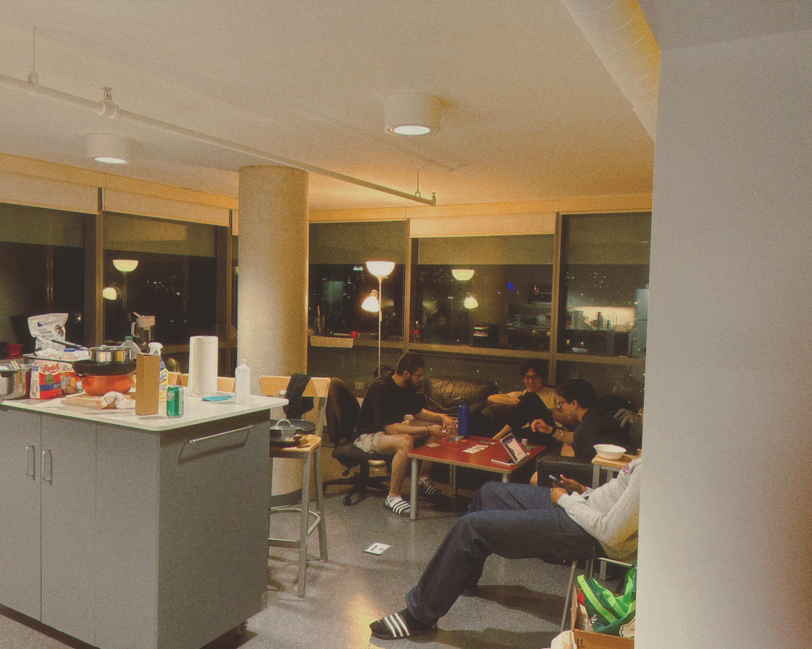

Today was my last day at Woodsworth Residence. My exams ended earlier than my roommates, so I was forced to move out first. This 17-storey glass building I've called home for the past two years has been such a big part of my life, and I'd like to share that with you.

My first year was a little uneventful. Second year, however, could not have been more different. The five guys (haha) I spent the last 8 months with created the most unique living conditions I will ever get the honour of experiencing. An unbelievable amount of foolishness and frolicking was achieved in that time.
I once came out of the shower to see 20 sticky notes arranged in the shape of a penis on my door and my computer background changed into two men kissing. My fault, of course. I should have known to close my own door. I then walked into the living room and saw all of the furniture completely reversed and facing the wrong way. It was a good laugh.

I want to give credit to my roommates, so I will name them all.

Jerome, the Singaporean. Luscious locks and big eyes, my 小可爱 (little cutie). That's what he calls me, at least. He's a masterful chef and very chill. Always seems unbothered by life. He knows how to swear in about 8 different languages, and you'll never catch him swearing in less than 2. 

Aidan, the first Indian. Short and wide, shaped like a brick. He's also a masterful chef. He has a lovable personality and is a very early sleeper. The number of times he's told us to shut up at 10pm is uncountable. 

Vir, the second Indian. He is the second one because he would hate to be called the second one. He's got a quick mouth and drinks three cups of coffee a day. You couldn't go a single day without hearing him singing in Hindi. He also doesn't sleep with underwear on. 

Alex, the Korean. He really loves being Korean, and will never fail to let us know when we pronounce something wrong, or if something is done differently in Korea. He gets made fun of for that. He was quite reserved at first, but became as rambunctious as the rest of us by the end. He's moving back to Vancouver now, and I may not ever see him again.

Willis, the African. The tallest and strongest of us all. It always felt like he was off in his own world, but he'd show up out of the shadows occasionally. He always keeps his girl an arms length away from us, which is probably the smartest decision any of us made. As the smallest of the group, I've gotten flipped by him (as in completely turned upside down physically) several times.

These five gentlemen have been the worst and best roommates I could have ever asked for. I will miss them dearly. So when it came time to move out, I was quite sad. 

However, there is another line of experience that I realized I had overlooked for most of my life. I want to say it's _[dès vu](https://www.thedictionaryofobscuresorrows.com/concept/des-vu)_, but only for the small things. I'm not a very articulate person, so the only way I know how to properly explain this is with anecdotes.

Last night, I became painfully aware that I was doing my final nighttime routine at Woodsworth. As I stepped into the shower, I looked at the shower handle. I realized that I would miss the way I turned the temperature onto the exact setting I liked. I would miss the way that to make the water hot, you had to turn the handle to cold. I was scared I would forget, so I pulled out my phone and took a photo. 

	<figure>
		
		<figcaption>The shower handle — turning it to cold made the water hot</figcaption>
	</figure>

	There were so many little things that made living here special, many of which I never really thought of until it was time to leave. The way in which I experienced these little things would never happen again, and it made me quite sad. So I took more pictures. Of the drawer where I keep my electric shaver, of my room door slightly ajar right before I step in with my feet a little damp, of the living room from a 45 degree angle. It was probably a futile attempt at properly capturing these fleeting experiences, but I wanted to try regardless.

	<figure>
		
		<figcaption>Gotta get as much as I can out of my mood.camera purchase.</figcaption>
	</figure>

	<figure>
		
	</figure>

By the time I finished packing, I still didn't feel ready to leave. But the world moves on, and we're just dragged along with it. I said my goodbyes, dapped them all up and gave them a hug, and rolled my things to the door. As I looked back, I could see them playing poker and laughing. I knew that if I hesitated just a little longer, I'd start tearing up. Since I'd never let them catch me crying in front of them, I walked out the door and down the hallway until the sounds of their laughter faded into nothing.
